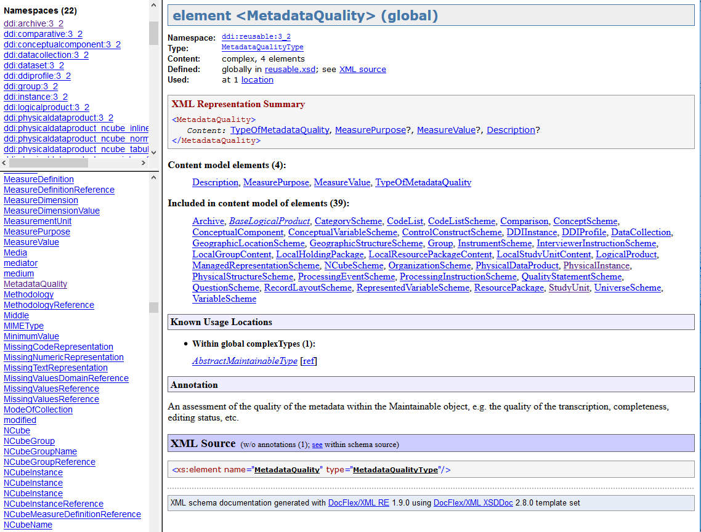

*****************************
Field Level Documentation
*****************************

Field Level documentation in HTML format, produced directly from the XML schemas is available in the downloaded bundle and online at https://ddialliance.org/Specification/DDI-Lifecycle/3.2/XMLSchema/FieldLevelDocumentation/ 

It provides a brief description of the purpose and content of the object. Documentation found in the complex Type description will provide more detail than the element documentation. Within a complex type, the additional documentation of sub-elements will focus on its purpose within the context of the complex type.

Using the HTML Field Level Documentation
-----------------------------------------

The HTML documentation is generated from the content of the DDI schema set. The upper left frame contains primary navigation and opens on the Overview which lists the Namespaces and XML Schemas that comprise DDI Lifecycle. The lower left frame lists All Components, Elements, 
Complex Elements, Simple Types, Element Groups, Attributes, and Attribute Groups). 

It seems like a lot but over half the XML Schemas, all the Element Groups, Attributes, and Attribute Groups are there to support the use of XHTML or Dublin Core. The lower left frame can be focused on a single XML Schema content by clicking on the name of that XML Schema in the upper left Frame.

Field level documentation provides information on what the field contains and if it is a complex element how the elements and attributes within it are used. If you need to know what a specific element contains you can find it in the alphabetical element list in the lower left frame and click on it, for example, MetadataQuality.

