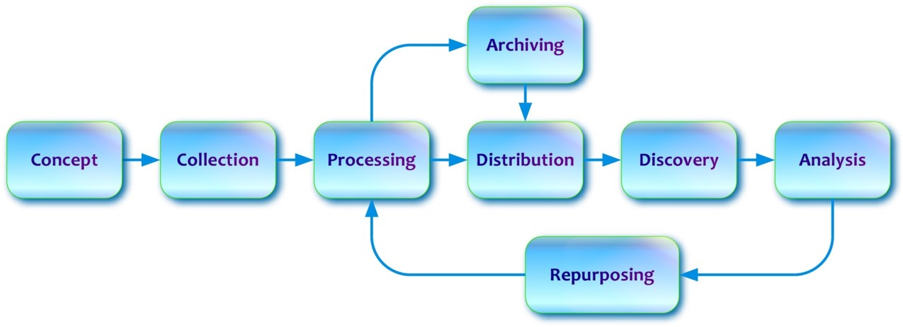

***************************
User Guide Documentation
***************************

The User Guide provides an introduction to DDI-Lifecycle, its scope, its main features, and its relationship to DDI-Codebook

High level life-cycle model

based on topic areas in DDI Model documentation

- Administrative
- Comparison
- Data Capture
- Data Description
- Foundational
- Grouping
- Schemes
- Survey Development
- Statistical Classification

Also, some other high level topics relating to implementation that were in the old User Guide
