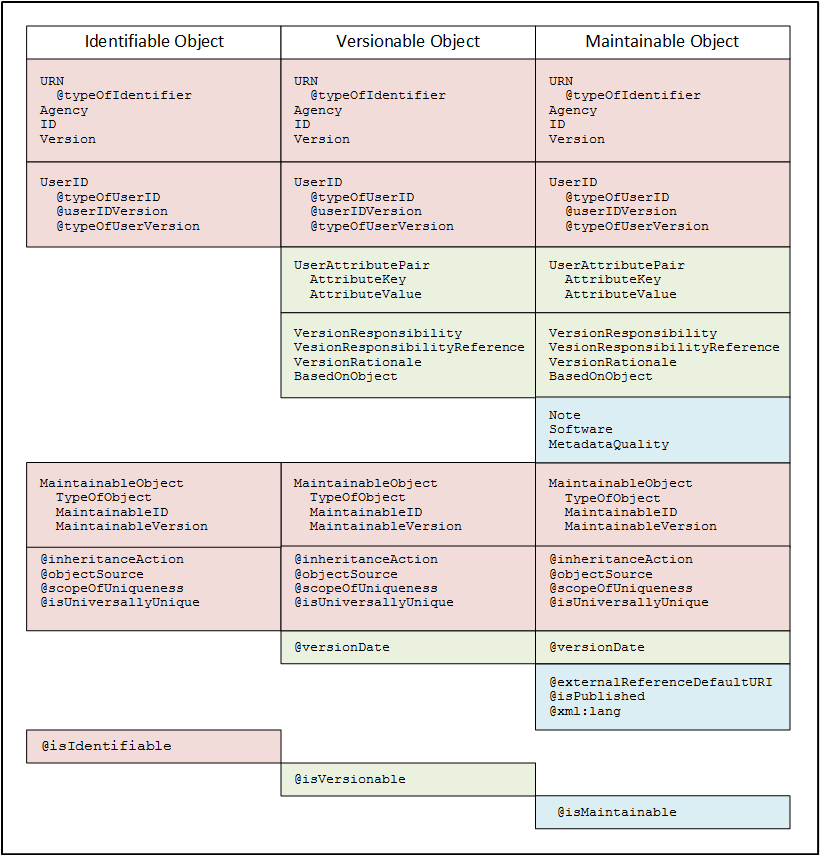
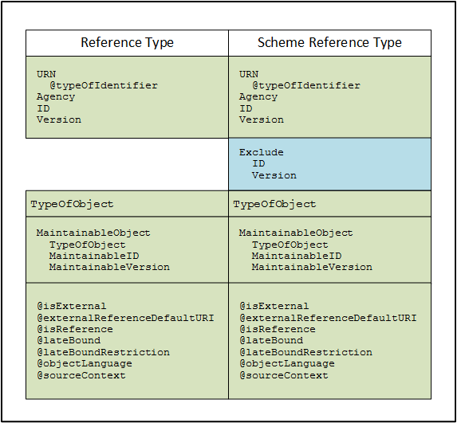

General Structures
===================

Identification
---------------

The identification structure of DDI objects is core to the functioning of the standard. The purpose of the DDI identification structure is to:

-  Uniquely identify major objects in a persistent manner to ensure
   accurate reference and retrieval of the object content
-  Provide context for objects where an understanding of related object
   types within a packaging structure is essential to the understanding
   of the object (i.e., a specific classification within a
   classification scheme)
-  Manage metadata object change over time
-  Support the range of object management used by different
   organizations
-  Support early and late binding of references
-  Support interaction with closely related standards, in particular
   ISO/IEC 11179 and SDMX

The identification structure is based on the ISO/IEC 11179 structure that requires a three-part means of unique identification.

+---------------------+----------------------------------------------------------------------+------------------------------------------------------------------------------------------------------------------------------------------------------------------------------------------------------------------------------------------+
| OBJECT              | ISO/IEC 11179                                                        | DDI                                                                                                                                                                                                                                      |
+=====================+======================================================================+==========================================================================================================================================================================================================================================+
| Agency Identifier   | A unique identifier for the agency managing the object               | A unique identifier for an agency registered with the DDI Alliance. The agency may have multiple sub-agency extensions managed within the DDI Registry or within the primary agency. An agency and sub-agency are separated by an “.”.   |
+---------------------+----------------------------------------------------------------------+------------------------------------------------------------------------------------------------------------------------------------------------------------------------------------------------------------------------------------------+
| Unique ID           | A unique identifier of the object within the context of the agency   | An identification which is unique within                                                                                                                                                                                                 |
|                     |                                                                      |                                                                                                                                                                                                                                          |

|                     |                                                                      | a) the agency (sub-agency), or                                                                                                                                                                                                           |
|                     |                                                                      |                                                                                                                                                                                                                                          |
|                     |                                                                      | b) within the parent maintainable. If the context is the parent maintainable the Unique ID is the ID of the parent maintainable plus the ID of the object within that maintainable separated by a “.”.                                   |
+---------------------+----------------------------------------------------------------------+------------------------------------------------------------------------------------------------------------------------------------------------------------------------------------------------------------------------------------------+
| Version Number      | A version number of the object to track change over time             | A version number with any number of extensions separated by a “.”.                                                                                                                                                                       |
+---------------------+----------------------------------------------------------------------+------------------------------------------------------------------------------------------------------------------------------------------------------------------------------------------------------------------------------------------+

This three part structure is the equivalent of a unique persistent identifier for an object, such as described by DOIs and other similar
structures. Note that while use of a version number with a DOI is  optional, based on local practice, the Version Number in DDI is required
due to the need to manage metadata within a dynamic workflow over time.

Scope of Uniqueness
....................

DDI 3.2 onwards supports scoping the uniqueness of identifier to the parent Maintainable or to the Agency (subagency). This choice affects the
structure of the ID as it appears within the Canonical URN (see Type of Identifier below). Essentially, when the ID is scoped to the
Agency the unique identification of an object requires the Agency, ID of the object, and Version Number of the object. When the ID is scoped to
the Maintainable the unique identification of a non-Maintainable object requires the Agency, ID of the parent Maintainable, the ID of the
object, and the Version Number of the object. The attribute scopeOfUniqueness is required and must contain either “Agency” or
“Maintainable”. This attribute defines how the ID will be expressed in the Canonical URN and what is required for a complete reference to the
object within the Maintaining Agency.

Type of Identifier
...................

DDI 3.2 onwards supports two formats for expressing the Identification Sequence as a URN. 

The *Canonical URN* is recommended. The *Deprecated URN* is a modification of the DDI 3.1 URN. 

Whether the identification information is expressed as a URN or using the Identification Sequence the attribute “typeOfIdentifier” on the URN dictates the format of the URN supported internally by the agency and the format of the URN used by an external
reference to that object. Note that regardless of the type of identifier used it is good practice to provide the full content of the Identification Sequence and details of the MaintainableObject for non-Maintainable objects in order to support the creation of any format
of a DDI URN.

Structure of the URN
'''''''''''''''''''''

Canonical URN
~~~~~~~~~~~~~

Each section of the Canonical URN is separated by a “:” (colon). Within
the ID section the Maintainable ID and Object ID are separated by a “.”
(dot).

urn:ddi:agency[.sub-agency]:ID:Version

If the scopeOfUniqueness equals “Agency” the ID is the ID of the object.

*Example: Canonical URN with uniqueness scoped to the Agency*

Object V321 version 2 within the Minnesota Population Center (us.mpc)

urn:ddi:us.mpc:V321:2

Object V321 version 2 within the Minnesota Population Center, Project
IPUMS (listed as a sub-agency within us.mpc)

urn:ddi:us.mpc.ipums:V321:2

If the scopeOfUniqueness equals “Maintainable” the ID of a
non-Maintainable object is structured as follows:

urn:ddi:agency[.sub-agency]:MaintainableID.ObjectID:Version

*Example: Canonical URN with uniqueness scoped to the Maintainable*

Variable V321 version 2 within VariableScheme VS1 at the Minnesota
Population Center (us.mpc)

urn:ddi:us.mpc:VS1.V321:2

Variable V321 version 2 within VariableScheme VS1 at the Minnesota
Population Center, Project IPUMS (listed as a sub-agency within us.mpc)

urn:ddi:us.mpc.ipums:VS1.V321:2

Deprecated URN
~~~~~~~~~~~~~~

Each section of the Deprecated URN is separated by a “:” (colon).

    “urn:ddi:agency[.subagency]:MaintainableObjectType:MaintainableID:ObjectType:ObjectID:ObjectVersion”

If the object itself is Maintainable the information on the parent
maintainable is not included:

urn:ddi:agency[.sub-agency]: ObjectType:ObjectID:ObjectVersion

If the scopeOfUniqueness equals “Agency” the ID is the ID of the object.

*Example: Deprecated URN with uniqueness scoped to the Agency*

Object V321 version 2 within the Minnesota Population Center (us.mpc)

urn:ddi:us.mpc:Variable:V321:2

Object V321 version 2 within the Minnesota Population Center, Project
IPUMS (listed as a sub-agency within us.mpc)

urn:ddi:us.mpc.ipums:Variable:V321:2

If the scopeOfUniqueness equals “Maintainable” the ID of a
non-Maintainable object is structured as follows:

urn:ddi:agency[.subagency]:MaintainableObjectType:MaintainableID:ObjectType:ObjectID:ObjectVersion

*Example: Deprecated URN with uniqueness scoped to the Maintainable*

Variable V321 version 2 within VariableScheme VS1 at the Minnesota
Population Center (us.mpc)

urn:ddi:us.mpc:VariableScheme:VS1:Variable:V321:2

Variable V321 version 2 within VariableScheme VS1 at the Minnesota
Population Center, Project IPUMS (listed as a sub-agency within us.mpc)

urn:ddi:us.mpc.ipums:VariableScheme:VS1:Variable:V321:2

Identifiable, Versionable, and Maintainable
-------------------------------------------

DDI differentiates between a set of element types. Not all objects are individually identifiable, i.e. some objects only have meaning within
the context of an identifiable object such as a Label or Description. The remaining objects are Identifiable, Versionable or Maintainable in
order to support different levels of metadata management.

Identifiable
..............

*Identifiable objects* are those that can be referenced directly either or inclusion in another object or for the purpose of attaching Other Material or a Note to the object. 

Identifiable objects have a unique ID within the context of their specified scope of uniqueness (see Scope of
Uniqueness discussion within this section). Their Agency Identification and Version Number match those of the object’s immediate parent
Versionable (or Maintainable if there is not a parent Versionable) at the point of creation. This means that if an Identifiable object is created within a version 1 of a parent Versionable and does NOT change its content over time it will retain its Version Number of 1 until the identifiable object itself is altered. It will then change its Version Number to that of its parent Versionable at the time of the alteration.

In other words an Identifiable could go from a Version 1 to a Version 4 without ever having a Version 2 or 3 if the cause for versioning did not involve any change in the Identifiable object within Version 2 and 3 of the parent Versionable.

Versionable
............

A *Versionable object* has the characteristics of an Identifiable object but may be managed over time. 

DDI has determined that being able to tack change within the object over time is a requirement, either to understand the relationship to earlier objects of a similar type or to track provenance. 

Note that it is up to the individual content provider to determine whether an object is essentially new or is a modification (version) of an earlier object. Versionable objects have a unique ID within the context of their specified scope of uniqueness (see Scope of
Uniqueness discussion within this section). Their Agency identificationmatches that of the object’s immediate parent Maintainable at the point of creation. 

In other words the Agency of an object does not change simply because it is included by reference in a Maintainable managed by a different agency. The Version number of the object changes each time its content changes. See Versioning for a discussion of when and how this may be implanted within different organizations or projects. 

Maintainable
.............

A *Maintainable object* is a type of packaging and generally takes the form of either a module or scheme. 

Modules package metadata focused on specified segments of the Lifecycle for which context is important for understanding. 

Schemes are similar to data base tables, containing a stack of similar type objects that many have important contextual
relevance to each other, i.e. a classification scheme captured in a DDI Category Scheme. There is one unique form of a Maintainable which is the CodeList. A CodeList is a Maintainable in its own right for the purpose of supporting the statistical production process. However it can only be published within the context of a parent Maintainable Scheme. 

All Schemes and Modules may be published within the context of a Study Unit or Group (a collection of Study Units) or as a separate Resource Package item primarily for the purpose of reuse.

**Figure 2.  The relationship between identifiable, versionable and maintainable type objects**

|figure2|

N.B.Those names starting with @ are XML attributes, all others are XML
elements.

The following objects which consist of the extension bases used for
identification and referencing purposes are considered to be
Administrative metadata for the purposes of versioning:

Identifiable
-------------

+------------------------+------------------------------------------------------------------------------------------------------------------------------------------------------------------------------------+
| Identifiable Object    | Extension base is AbstractIdentifiable                                                                                                                                             |
+========================+====================================================================================================================================================================================+
| URN                    | See URN Structure below                                                                                                                                                            |
+------------------------+------------------------------------------------------------------------------------------------------------------------------------------------------------------------------------+
| @typeOfIdentifier      | URN used by Agency [Canonical \| Deprecated]                                                                                                                                       |
+------------------------+------------------------------------------------------------------------------------------------------------------------------------------------------------------------------------+
| Agency                 | Base sequence of identification. If sequence is used, all are required.                                                                                                            |
+------------------------+------------------------------------------------------------------------------------------------------------------------------------------------------------------------------------+
| ID                     |                                                                                                                                                                                    |
+------------------------+------------------------------------------------------------------------------------------------------------------------------------------------------------------------------------+
| Version                |                                                                                                                                                                                    |
+------------------------+------------------------------------------------------------------------------------------------------------------------------------------------------------------------------------+
| UserID                 |                                                                                                                                                                                    |
+------------------------+------------------------------------------------------------------------------------------------------------------------------------------------------------------------------------+
| @typeOfUserID          | A user specified identification for a specific system such as a DOI or internal search engine. Both the ID and @typeOfUserID must be specified. Version information is optional.   |
+------------------------+------------------------------------------------------------------------------------------------------------------------------------------------------------------------------------+
| @userIDVersion         |                                                                                                                                                                                    |
+------------------------+------------------------------------------------------------------------------------------------------------------------------------------------------------------------------------+
| @typeOfUserVersion     |                                                                                                                                                                                    |
+------------------------+------------------------------------------------------------------------------------------------------------------------------------------------------------------------------------+
| MaintainableObject     |                                                                                                                                                                                    |
+------------------------+------------------------------------------------------------------------------------------------------------------------------------------------------------------------------------+
| TypeOfObject           | The Maintainable object containing the Identifiable object. TypeOfObject is required to create Deprecated URN. ID is required for any URN if                                       |
|                        |                                                                                                                                                                                    |
|                        | ScopeOfUniqueness = ”Maintainable”.                                                                                                                                                |
|                        |                                                                                                                                                                                    |
|                        | Version number provides context base.                                                                                                                                              |
+------------------------+------------------------------------------------------------------------------------------------------------------------------------------------------------------------------------+
| MaintainableID         |                                                                                                                                                                                    |
+------------------------+------------------------------------------------------------------------------------------------------------------------------------------------------------------------------------+
| MaintainableVersion    |                                                                                                                                                                                    |
+------------------------+------------------------------------------------------------------------------------------------------------------------------------------------------------------------------------+
| @inheritanceAction     | See Grouping: Inheritance                                                                                                                                                          |
+------------------------+------------------------------------------------------------------------------------------------------------------------------------------------------------------------------------+
| @objectSource          | The object source of a resolved reference                                                                                                                                          |
+------------------------+------------------------------------------------------------------------------------------------------------------------------------------------------------------------------------+
| @scopeOfUniqueness     | Scope used by Agency [Agency \| Maintainable                                                                                                                                       |
+------------------------+------------------------------------------------------------------------------------------------------------------------------------------------------------------------------------+
| @IsUniversallyUnique   | States the scope of uniqueness for the ID                                                                                                                                          |
+------------------------+------------------------------------------------------------------------------------------------------------------------------------------------------------------------------------+
| @isIdentifiable        | Fixed value = “true” [specifies object base]                                                                                                                                       |
+------------------------+------------------------------------------------------------------------------------------------------------------------------------------------------------------------------------+

Versionable
-------------

+---------------------------------+------------------------------------------------------------------------------------------------------------------------------------------------------------------------------------+
| Versionable Object              | Extension base is AbstractIdentifiable                                                                                                                                             |
+=================================+====================================================================================================================================================================================+
| URN                             | See URN Structure below                                                                                                                                                            |
+---------------------------------+------------------------------------------------------------------------------------------------------------------------------------------------------------------------------------+
| @typeOfIdentifier               | URN used by Agency [Canonical \| Deprecated]                                                                                                                                       |
+---------------------------------+------------------------------------------------------------------------------------------------------------------------------------------------------------------------------------+
| Agency                          | Base sequence of identification. If sequence is used, all are required.                                                                                                            |
+---------------------------------+------------------------------------------------------------------------------------------------------------------------------------------------------------------------------------+
| ID                              |                                                                                                                                                                                    |
+---------------------------------+------------------------------------------------------------------------------------------------------------------------------------------------------------------------------------+
| Version                         |                                                                                                                                                                                    |
+---------------------------------+------------------------------------------------------------------------------------------------------------------------------------------------------------------------------------+
| UserID                          |                                                                                                                                                                                    |
+---------------------------------+------------------------------------------------------------------------------------------------------------------------------------------------------------------------------------+
| @typeOfUserID                   | A user specified identification for a specific system such as a DOI or internal search engine. Both the ID and @typeOfUserID must be specified. Version information is optional.   |
+---------------------------------+------------------------------------------------------------------------------------------------------------------------------------------------------------------------------------+
| @userIDVersion                  |                                                                                                                                                                                    |
+---------------------------------+------------------------------------------------------------------------------------------------------------------------------------------------------------------------------------+
| @typeOfUserVersion              |                                                                                                                                                                                    |
+---------------------------------+------------------------------------------------------------------------------------------------------------------------------------------------------------------------------------+
| UserAttributePair               |                                                                                                                                                                                    |
+---------------------------------+------------------------------------------------------------------------------------------------------------------------------------------------------------------------------------+
| AttributeKey                    | User defined Key/Value pair used to support interaction of the metadata within the user’s system.                                                                                  |
+---------------------------------+------------------------------------------------------------------------------------------------------------------------------------------------------------------------------------+
| AttributeValue                  |                                                                                                                                                                                    |
+---------------------------------+------------------------------------------------------------------------------------------------------------------------------------------------------------------------------------+
| VersionResponsibility           | Who within the Agency versioned the object                                                                                                                                         |
+---------------------------------+------------------------------------------------------------------------------------------------------------------------------------------------------------------------------------+
| VesionResponsibilityReference   | Alternate reference to who versioned the object                                                                                                                                    |
+---------------------------------+------------------------------------------------------------------------------------------------------------------------------------------------------------------------------------+
| VersionRationale                | Reason for version change (to inform user)                                                                                                                                         |
+---------------------------------+------------------------------------------------------------------------------------------------------------------------------------------------------------------------------------+
| BasedOnReference                |                                                                                                                                                                                    |
+---------------------------------+------------------------------------------------------------------------------------------------------------------------------------------------------------------------------------+
| MaintainableObject              |                                                                                                                                                                                    |
+---------------------------------+------------------------------------------------------------------------------------------------------------------------------------------------------------------------------------+
| TypeOfObject                    | The Maintainable object containing the Identifiable object. TypeOfObject is required to create Deprecated URN. ID is required for any URN if                                       |
|                                 |                                                                                                                                                                                    |
|                                 | ScopeOfUniqueness = ”Maintainable”.                                                                                                                                                |
|                                 |                                                                                                                                                                                    |
|                                 | Version number provides context base.                                                                                                                                              |
+---------------------------------+------------------------------------------------------------------------------------------------------------------------------------------------------------------------------------+
| MaintainableID                  |                                                                                                                                                                                    |
+---------------------------------+------------------------------------------------------------------------------------------------------------------------------------------------------------------------------------+
| MaintainableVersion             |                                                                                                                                                                                    |
+---------------------------------+------------------------------------------------------------------------------------------------------------------------------------------------------------------------------------+
| @inheritanceAction              | See Grouping: Inheritance                                                                                                                                                          |
+---------------------------------+------------------------------------------------------------------------------------------------------------------------------------------------------------------------------------+
| @objectSource                   | The object source of a resolved reference                                                                                                                                          |
+---------------------------------+------------------------------------------------------------------------------------------------------------------------------------------------------------------------------------+
| @scopeOfUniqueness              | Scope used by Agency [Agency \| Maintainable                                                                                                                                       |
+---------------------------------+------------------------------------------------------------------------------------------------------------------------------------------------------------------------------------+
| @IsUniversallyUnique            | States the scope of uniqueness for the ID                                                                                                                                          |
+---------------------------------+------------------------------------------------------------------------------------------------------------------------------------------------------------------------------------+
| @isVersionable                  | Fixed value = “true” [specifies object base]                                                                                                                                       |
+---------------------------------+------------------------------------------------------------------------------------------------------------------------------------------------------------------------------------+
| @versionDate                    | Date/Time of version change                                                                                                                                                        |
+---------------------------------+------------------------------------------------------------------------------------------------------------------------------------------------------------------------------------+

Maintainable
-------------

+---------------------------------+-----------------------------------------------------------------------------------------------------+
| Maintainable Object             | Extension base is AbstractMaintainable                                                              |
+=================================+=====================================================================================================+
| URN                             | See URN Structure below                                                                             |
+---------------------------------+-----------------------------------------------------------------------------------------------------+
| @typeOfIdentifier               | URN used by Agency [Canonical \| Deprecated]                                                        |
+---------------------------------+-----------------------------------------------------------------------------------------------------+
| Agency                          | Base sequence of identification. If sequence is used, all are required                              |
+---------------------------------+-----------------------------------------------------------------------------------------------------+
| ID                              |                                                                                                     |
+---------------------------------+-----------------------------------------------------------------------------------------------------+
| Version                         |                                                                                                     |
+---------------------------------+-----------------------------------------------------------------------------------------------------+
| UserID                          |                                                                                                     |
+---------------------------------+-----------------------------------------------------------------------------------------------------+
| @typeOfUserID                   | A user specified identification for a specific system such as a DOI or internal search engine.      |
|                                 |                                                                                                     |
|                                 | Version information is optional.                                                                    |
|                                 |                                                                                                     |
|                                 | Both the ID and @typeOfUserID must be specified.                                                    |
+---------------------------------+-----------------------------------------------------------------------------------------------------+
| @userIDVersion                  |                                                                                                     |
+---------------------------------+-----------------------------------------------------------------------------------------------------+
| @typeOfUserVersion              |                                                                                                     |
+---------------------------------+-----------------------------------------------------------------------------------------------------+
| UserAttributePair               |                                                                                                     |
+---------------------------------+-----------------------------------------------------------------------------------------------------+
| AttributeKey                    | User defined Key/Value pair used to support interaction of the metadata within the user’s system.   |
+---------------------------------+-----------------------------------------------------------------------------------------------------+
| AttributeValue                  |                                                                                                     |
+---------------------------------+-----------------------------------------------------------------------------------------------------+
| VersionResponsibility           | Who within the Agency versioned the object                                                          |
+---------------------------------+-----------------------------------------------------------------------------------------------------+
| VesionResponsibilityReference   | Alternate reference to who versioned the object                                                     |
+---------------------------------+-----------------------------------------------------------------------------------------------------+
| VersionRationale                | Reason for version change (to inform user)                                                          |
+---------------------------------+-----------------------------------------------------------------------------------------------------+
| BasedOnReference                |                                                                                                     |
+---------------------------------+-----------------------------------------------------------------------------------------------------+
| Note                            | Notes related to objects with the maintainable (Payload)                                            |
+---------------------------------+-----------------------------------------------------------------------------------------------------+
| Software                        | Software used to create the Maintainable object (Payload)                                           |
+---------------------------------+-----------------------------------------------------------------------------------------------------+
| MetadataQuality                 | Quality of the metadata in the Maintainable object (Payload)                                        |
+---------------------------------+-----------------------------------------------------------------------------------------------------+
| MaintainableObject              | Same as Identifiable Object                                                                         |
+---------------------------------+-----------------------------------------------------------------------------------------------------+
| @inheritanceAction              | See Grouping: Inheritance                                                                           |
+---------------------------------+-----------------------------------------------------------------------------------------------------+
| @objectSource                   | The object source of a resolved reference                                                           |
+---------------------------------+-----------------------------------------------------------------------------------------------------+
| @scopeOfUniqueness              | Scope used by Agency [Agency \| Maintainable                                                        |
+---------------------------------+-----------------------------------------------------------------------------------------------------+
| @IsUniversallyUnique            | States the scope of uniqueness for the ID                                                           |
+---------------------------------+-----------------------------------------------------------------------------------------------------+
| @isMaintainable                 | Fixed value = “true” [specifies object base]                                                        |
+---------------------------------+-----------------------------------------------------------------------------------------------------+
| @versionDate                    | Date/Time of version change                                                                         |
+---------------------------------+-----------------------------------------------------------------------------------------------------+
| @externalReferenceDefaultURI    | Indicates that the content is available for reuse by reference                                      |
+---------------------------------+-----------------------------------------------------------------------------------------------------+
| @isPublished                    | Indicates that the contents are persistent and can be referenced by external documents              |
+---------------------------------+-----------------------------------------------------------------------------------------------------+
| @xml:lang                       | The language of the metadata in the Maintainable object (Payload)                                   |
+---------------------------------+-----------------------------------------------------------------------------------------------------+

Reference and Scheme Reference Type
-------------------------------------------

Reference Type
...............
A *Reference Type" is a ............

Scheme Reference Type
......................

A *Scheme Reference Type" is a ............

**Figure 3.  The relationship between ReferenceType and SchemeReferenceType**

|figure3|

Reference Type
---------------

+--------------------------------+--------------------------------------------------------------------------------------------------------------------------------------------------------------------------------------------------------------------------------------+
| Reference Type                 |                                                                                                                                                                                                                                      |
+================================+======================================================================================================================================================================================================================================+
| URN                            | The URN of the object being referenced using the specified URN structure                                                                                                                                                             |
+--------------------------------+--------------------------------------------------------------------------------------------------------------------------------------------------------------------------------------------------------------------------------------+
| @typeOfIdentifier              | URN used by Agency [Canonical \| Deprecated]                                                                                                                                                                                         |
+--------------------------------+--------------------------------------------------------------------------------------------------------------------------------------------------------------------------------------------------------------------------------------+
| Agency                         | Base sequence of identification. If sequence is used, all are required.                                                                                                                                                              |
+--------------------------------+--------------------------------------------------------------------------------------------------------------------------------------------------------------------------------------------------------------------------------------+
| ID                             | The ID of the object being referenced.                                                                                                                                                                                               |
+--------------------------------+--------------------------------------------------------------------------------------------------------------------------------------------------------------------------------------------------------------------------------------+
| Version                        | The Version of the object being referenced. This is the full Version number at the time the reference is created.                                                                                                                    |
+--------------------------------+--------------------------------------------------------------------------------------------------------------------------------------------------------------------------------------------------------------------------------------+
| TypeOfObject                   | Type of object being referenced. This is a controlled list.                                                                                                                                                                          |
+--------------------------------+--------------------------------------------------------------------------------------------------------------------------------------------------------------------------------------------------------------------------------------+
| MaintainableObject             | The Maintainable object containing of the Identifiable or Versionable object being referenced.                                                                                                                                       |
+--------------------------------+--------------------------------------------------------------------------------------------------------------------------------------------------------------------------------------------------------------------------------------+
| TypeOfObject                   | TypeOfObject is required to create Deprecated URN                                                                                                                                                                                    |
+--------------------------------+--------------------------------------------------------------------------------------------------------------------------------------------------------------------------------------------------------------------------------------+
| MaintainableID                 | Required for any URN if                                                                                                                                                                                                              |
|                                |                                                                                                                                                                                                                                      |
|                                | ScopeOfUniqueness=”Maintainable”.                                                                                                                                                                                                    |
+--------------------------------+--------------------------------------------------------------------------------------------------------------------------------------------------------------------------------------------------------------------------------------+
| MaintainableVersion            | Provides context base                                                                                                                                                                                                                |
+--------------------------------+--------------------------------------------------------------------------------------------------------------------------------------------------------------------------------------------------------------------------------------+
| @isExternal                    | Boolean attribute. If “true” you must supply the URN                                                                                                                                                                                 |
+--------------------------------+--------------------------------------------------------------------------------------------------------------------------------------------------------------------------------------------------------------------------------------+
| @externalReferenceDefaultURI   | A local store for the referenced object expressed as a URI                                                                                                                                                                           |
+--------------------------------+--------------------------------------------------------------------------------------------------------------------------------------------------------------------------------------------------------------------------------------+
| @isReference                   | Fixed value = “true” [specifies object base]                                                                                                                                                                                         |
+--------------------------------+--------------------------------------------------------------------------------------------------------------------------------------------------------------------------------------------------------------------------------------+
| @lateBound                     | Boolean attribute. Set to “true” if you wish to late-bind the reference (i.e., want to reference the most recent version)                                                                                                            |
+--------------------------------+--------------------------------------------------------------------------------------------------------------------------------------------------------------------------------------------------------------------------------------+
| @lateBoundRestriction          | If @lateBound=”true” and this attribute is not provided you will get the most recent version. Use this attribute to restrict the value of the late-bind, for example to restrict to the most recent minor version of major version   |
+--------------------------------+--------------------------------------------------------------------------------------------------------------------------------------------------------------------------------------------------------------------------------------+
| @objectLanguage                | Specify the desired language content (if available) for the referenced item using a valid xml:lang value.                                                                                                                            |
+--------------------------------+--------------------------------------------------------------------------------------------------------------------------------------------------------------------------------------------------------------------------------------+
| @sourceContext                 | The URN of the parent maintainable at the time of reference (this is not necessarily the same version number as the version of the parent maintainable at point of origin)                                                           |
+--------------------------------+--------------------------------------------------------------------------------------------------------------------------------------------------------------------------------------------------------------------------------------+

Scheme Reference Type
-----------------------

+--------------------------------+--------------------------------------------------------------------------------------------------------------------------------------------------------------------------------------------------------------------------------------+
| Scheme Reference Type          |                                                                                                                                                                                                                                      |
+================================+======================================================================================================================================================================================================================================+
| URN                            | The URN of the object being referenced using the specified URN structure                                                                                                                                                             |
+--------------------------------+--------------------------------------------------------------------------------------------------------------------------------------------------------------------------------------------------------------------------------------+
| @typeOfIdentifier              | URN used by Agency [Canonical \| Deprecated]                                                                                                                                                                                         |
+--------------------------------+--------------------------------------------------------------------------------------------------------------------------------------------------------------------------------------------------------------------------------------+
| Agency                         | Base sequence of identification. If sequence is used, all are required.                                                                                                                                                              |
+--------------------------------+--------------------------------------------------------------------------------------------------------------------------------------------------------------------------------------------------------------------------------------+
| ID                             | The ID of the object being referenced.                                                                                                                                                                                               |
+--------------------------------+--------------------------------------------------------------------------------------------------------------------------------------------------------------------------------------------------------------------------------------+
| Version                        | The Version of the object being referenced. This is the full Version number at the time the reference is created.                                                                                                                    |
+--------------------------------+--------------------------------------------------------------------------------------------------------------------------------------------------------------------------------------------------------------------------------------+
| TypeOfObject                   | Type of object being referenced. This is a controlled list.                                                                                                                                                                          |
+--------------------------------+--------------------------------------------------------------------------------------------------------------------------------------------------------------------------------------------------------------------------------------+
| MaintainableObject             | The Maintainable object containing of the Identifiable or Versionable object being referenced.                                                                                                                                       |
+--------------------------------+--------------------------------------------------------------------------------------------------------------------------------------------------------------------------------------------------------------------------------------+
| TypeOfObject                   | TypeOfObject is required to create a Deprecated URN                                                                                                                                                                                  |
+--------------------------------+--------------------------------------------------------------------------------------------------------------------------------------------------------------------------------------------------------------------------------------+
| MaintainableID                 | Required for any URN if                                                                                                                                                                                                              |
|                                |                                                                                                                                                                                                                                      |
|                                | ScopeOfUniqueness=”Maintainable”.                                                                                                                                                                                                    |
+--------------------------------+--------------------------------------------------------------------------------------------------------------------------------------------------------------------------------------------------------------------------------------+
| MaintainableVersion            | Provides context base                                                                                                                                                                                                                |
+--------------------------------+--------------------------------------------------------------------------------------------------------------------------------------------------------------------------------------------------------------------------------------+
| Exclude                        | Allows the identification of objects within the                                                                                                                                                                                      |
|                                |                                                                                                                                                                                                                                      |
|                                | Scheme which are to be excluded for the                                                                                                                                                                                              |
|                                |                                                                                                                                                                                                                                      |
|                                | purpose of this reference.                                                                                                                                                                                                           |
+--------------------------------+--------------------------------------------------------------------------------------------------------------------------------------------------------------------------------------------------------------------------------------+
| ID                             | The ID of the excluded object.                                                                                                                                                                                                       |
+--------------------------------+--------------------------------------------------------------------------------------------------------------------------------------------------------------------------------------------------------------------------------------+
| Version                        | The Version of the excluded object.                                                                                                                                                                                                  |
+--------------------------------+--------------------------------------------------------------------------------------------------------------------------------------------------------------------------------------------------------------------------------------+
| @isExternal                    | Boolean attribute. If “true” you must supply the URN                                                                                                                                                                                 |
+--------------------------------+--------------------------------------------------------------------------------------------------------------------------------------------------------------------------------------------------------------------------------------+
| @externalReferenceDefaultURI   | A local store for the referenced object expressed as a URI                                                                                                                                                                           |
+--------------------------------+--------------------------------------------------------------------------------------------------------------------------------------------------------------------------------------------------------------------------------------+
| @isReference                   | Fixed value = “true” [specifies object base]                                                                                                                                                                                         |
+--------------------------------+--------------------------------------------------------------------------------------------------------------------------------------------------------------------------------------------------------------------------------------+
| @lateBound                     | Boolean attribute. Set to “true” if you wish to late-bind the reference (i.e., want to reference the most recent version)                                                                                                            |
+--------------------------------+--------------------------------------------------------------------------------------------------------------------------------------------------------------------------------------------------------------------------------------+
| @lateBoundRestriction          | If @lateBound=”true” and this attribute is not provided you will get the most recent version. Use this attribute to restrict the value of the late-bind, for example to restrict to the most recent minor version of major version   |
+--------------------------------+--------------------------------------------------------------------------------------------------------------------------------------------------------------------------------------------------------------------------------------+
| @objectLanguage                | Specify the desired language content (if available) for the referenced item using a valid xml:lang value.                                                                                                                            |
+--------------------------------+--------------------------------------------------------------------------------------------------------------------------------------------------------------------------------------------------------------------------------------+
| @sourceContext                 | The URN of the parent maintainable at the time of reference (this is not necessarily the same version number as the version of the parent maintainable at point of origin)                                                           |
+--------------------------------+--------------------------------------------------------------------------------------------------------------------------------------------------------------------------------------------------------------------------------------+

Administrative and Payload Metadata
-----------------------------------

The differentiation between Administrative metadata and Payload metadata lies primarily in how changes to the metadata content drive version changes.

*Administrative metadata* is content that is related to the interaction or use of the metadata within a specific system. Changes in
administrative metadata do not change the meaning of the metadata content of the object in terms of its DDI identification or intellectual meaning. For example, the addition of a local User Identification to facilitate interaction between the metadata object and local access software, or creating a URN entry from existing identification sequence content are considered to be changes to the Administrative metadata. A change in Administrative metadata does not trigger a change in the version number of a published object.

*Payload metadata* is all metadata *NOT defined* as Administrative. Payload metadata contains intellectual content that has an impact on the meaning or application of the object. A change in Payload metadata generally triggers a change in the version number of a published object.

[REFERENCE TO APPENDIX WITH LIST OF CONTENT THAT IS ADMIN OR PAYLOAD]

    
