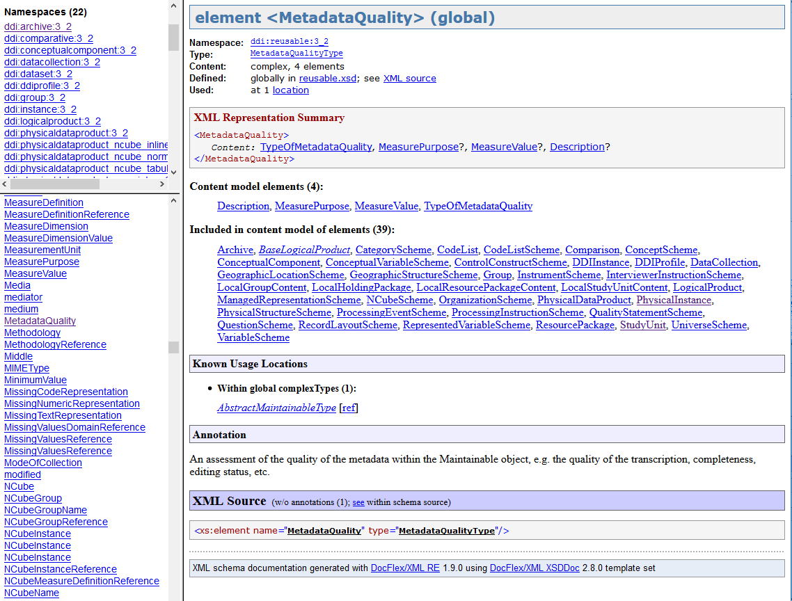

.. _fld-label:

*****************************
Field Level Documentation
*****************************

Field Level documentation in HTML format, produced directly from the XML schemas is available in the downloaded bundle and online at https://ddialliance.org/Specification/DDI-Lifecycle/3.2/XMLSchema/FieldLevelDocumentation/ 

It provides a brief description of the purpose and content of the object. Documentation found in the complex Type description will provide more detail than the element documentation. Within a complex type, the additional documentation of sub-elements will focus on its purpose within the context of the complex type.

Using the HTML Field Level Documentation
-----------------------------------------

The HTML documentation is generated from the content of the DDI schema set. The upper left frame contains primary navigation and opens on the Overview which lists the Namespaces and XML Schemas that comprise DDI Lifecycle. The lower left frame lists All Components, Elements, 
Complex Elements, Simple Types, Element Groups, Attributes, and Attribute Groups). 

It seems like a lot but over half the XML Schemas, all the Element Groups, Attributes, and Attribute Groups are there to support the use of XHTML or Dublin Core. The lower left frame can be focused on a single XML Schema content by clicking on the name of that XML Schema in the upper left Frame.

Field level documentation provides information on what the field contains and if it is a complex element how the elements and attributes within it are used. If you need to know what a specific element contains you can find it in the alphabetical element list in the lower left frame and click on it, for example, MetadataQuality.

The right frame now provides information on the element MetadataQuality including what namespace it is in, the type, contents, where it is defined, and where it is used. 

This is followed by the XML Representation Summary which is a listing of each element followed by a symbol to indicate its cardinality.

The convention used is:

+-----------+--------+-------------------------+
| Element   | Symbol | Description             |  
+-----------+--------+-------------------------+
| ElementA  |  [ ]   | required/not repeatable |
+-----------+--------+-------------------------+
| ElementB  |  [+]   | required/repeatable     |
+-----------+--------+-------------------------+
| ElementC  |  [?]   | optional/not repeatable |
+-----------+--------+-------------------------+
| ElementD  |  [*]   | optional/repeatable     |
+-----------+--------+-------------------------+

The elements within the content model are listed in alphabetical order followed by the list of elements where MetadataQuality is available, known usage locations, documentation (annotation), and the XML Source. 

All of these contain clickable links for additional details. For the full description of the structure click on the “Type:” in the top section. This will provide content and documentation details for the structure. To understand the use of the object in a specific location click on the name of the object that includes it.

Now in addition to the information on first screen you have more extensive documentation for the complex element, a more detailed XML Source showing order and cardinality as XML schema, and content element detail including type information and documentation of what each element is intended to contain.

If you are starting from scratch and just want to explore, start at the elelment DDIInstance, which is the top level publishing strcuture in DDI and work you way down through the structures of the preimary document types.

The most commonly used DDI lifecycle document is StudyUnit and it corresponds most closely to the content coverage of DDI Codebook (https://ddialliance.org/Specification/DDI-Codebook/2.5/). 

See DDI Structural Features for basic content organization [2.1 Exchange structures, and 2.2 Maintainable structures].
