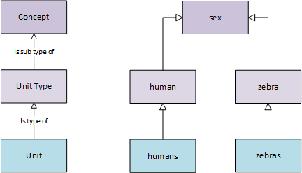

*************
Introduction
*************

DDI-Lifecycle is designed to document and manage data across the entire life cycle, from conceptualization to data publication and analysis and beyond. It encompasses all of DDI-Codebook (https://ddialliance.org/Specification/DDI-Codebook/2.5/) specification and extends it.

.. image:: ../images/DDILifecycle.jpg
   :width: 600px

Figure 1 - DDI Lifecycle Model:

DDI-Lifecycle Coverage
----------------------------

Concept, Unit Type and Unit
_____________________________

DDi-Lifecycle mirrors ISO/IEC 11179. Concepts are a unit of knowledge created by a unique combination of characteristics, a Unit Type is a synonym of Object, which is a class or object of interest. The combination allows a single concept to be used between different Unit Types and hence Units.  

A Concept may have sub-concepts, and can be organised hierachically.

Universe and population
_____________________________

DDI-Lifecycle differentiates between a Universe and a population. A universe is a restriction on a Unit Type (e.g. live births) of humans, and a population is a universe bounded by time and geography. **N.B.** DDI-Lifecycle does not have an explicit population element, but allows it to be described.

Concepts and other elements in DDI-Lifecycle
_____________________________________________

Concepts are a cornerstone of DDI-Lifecycle, nearly 50 elements have a relationship to it. These include (among others):

- Categories and ClassificationItems
- Conceptual Variables, Represented Variables and Variables
- Geographic Location and Geographic Structure Groups
- Measurement Items
- Questions (Items, Grids and Blocks)
- Quality Standards
- Sampling Information
- Universe and Unit Type (as described above)

A Study is composed of many elements, DDI-Lifecycle allows these to be captured and described in a consistent manner so that the data can be used independently of the producer.

Study Unit
  - is made up of information about who did what and information about its dissemination – it is designed to describe for instance a sweep or wave of a ‘study’

Conceptual
  - comprises those elements that define the ideas and concepts, the data that will be generated, the universe of interest and the   geographical area of interest

Data Collection
  - describes how and why and in which way the data was collected, including methodology used, and any processing

Data
  - Logical Product 
    – describes the data, the meaning of the data, the relationships between the different data items

  - Physical Product 
    – describes the structure and layout of the data, irrespective of the physical rendering of the data

  - Physical Instance 
    – describes the actual data, provides a place to cite and describe the coverage, where it is located and any issues relating to quality and statistical summaries

DDI Lifecycle Coverage:

Foundational Elements
______________________

Concept, UnitType, Universe
SubUniverseClass

Category
CodeList

ConceptualComponent

Individual
Organization
Relation

- Data Capture
- Data Description
- Survey Development
- Statistical Classification
- Administrative
- Comparison
- Grouping
- Schemes

Also, some other high level topics relating to implementation that were in the old User Guide
