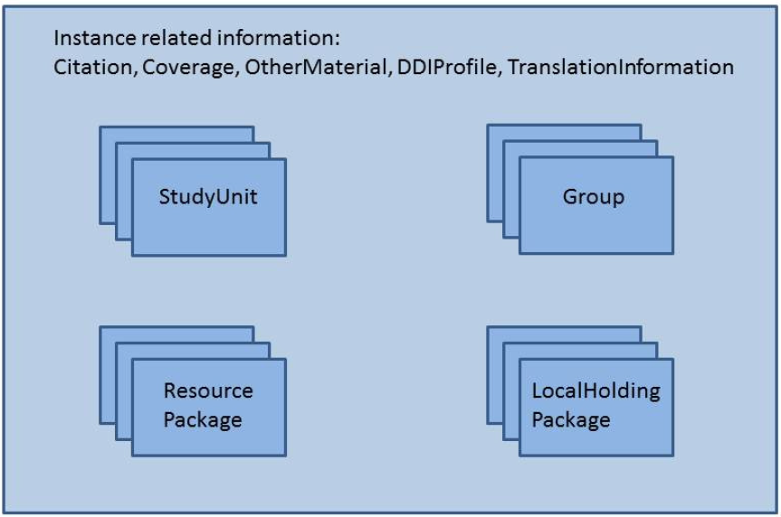
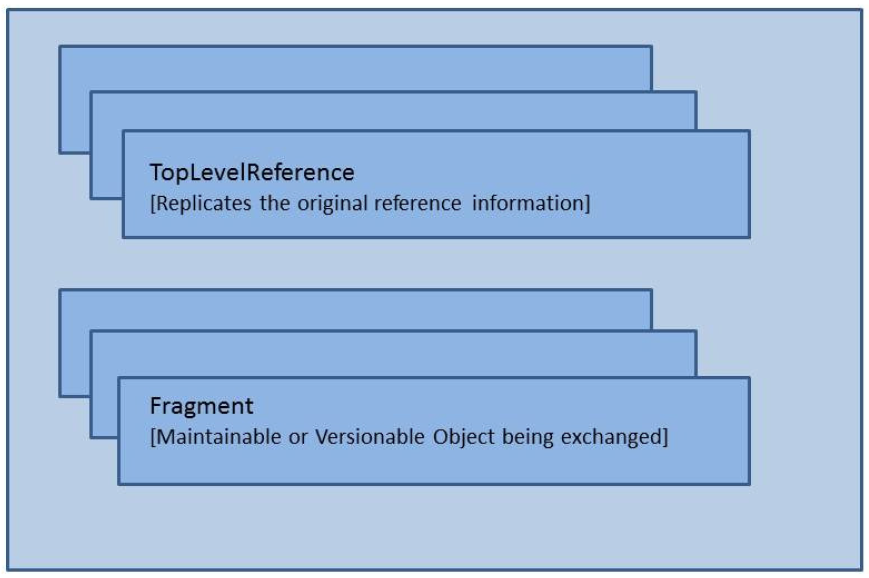

Structural Features
*******************

Exchange structures
---------------------

DDI Lifecycle instances are published and exchanged with one of two external wrappers, DDIInstance or FragmentInstance. 

The DDIInstance provides a consistent top-level publication wrapper and in addition to some basic information about itself serves as the publication wrapper 
for four primary documenttypes: StudyUnit, Group, ResourcePackage, and LocalHoldingPackage.

The FragmentInstance is a uniform package used to transfer maintainable or versionable objects plus any associated Notes or
OtherMaterial. These would be packets sent in response to system calls (external references, query calls, etc.).

DDI Instance:

The Citation, Coverage, OtherMaterial, DDIProfile, and TranslationInformation pertain to the DDI Instance as a whole. Note that the DDIInstance may be viewed as a temporary wrapper for publishing or transporting any of the major publication structures within DDI.

Fragment Instance:

The FragmentInstance is a wrapper for transporting a response to a request for a specific set of information. Although Maintainable, Versionable, and Identifiable objects may be referenced, the FragmentInstance can only transport a Maintainable or Versionable object. 

If an Identifiable is the referenced object, its parent Versionable (or Maintainable) will be supplied. A FragmentInstance may
contain any number of Versionable or Maintainable ojbects. The objects that are the specific responses to the request are listed in the TopLevelReference. For example, a single CodeList (Versionable object) may be requested and the FragmentInstance sent in response may contain the CodeList, the containing CodeListScheme, the referenced Categories, and the containing CategoryScheme. The requested
CodeList would be noted in the TopLevelReference and the content of the returned objects would make up the Fragments.

Maintainable structures
------------------------

DDI has two types of maintainable structures; Modules and Schemes. Modules are conceptually related groups of metadata related to stages within a lifecycle. Schemes are maintainable lists of reusable objects of specified generic types (i.e., questions) and include a means of expressing groups of these objects for administrative purposes. 

The following is a list of Modules and Schemes available in DDI Lifecycle along with the namespace of the object, the object name, and a description.

Modules
________

+--------+-------------------------+-----------------------------------------------------------------------------------+
| Prefix | Module Name             | Description                                                                       |  
+--------+-------------------------+-----------------------------------------------------------------------------------+
| a      | Archive                 | Contains information concerning the organization providing archival functions,    |
|        |                         | the position of the related metadata and data within the organization, and        |
|        |                         | preservation/provenance information about the metadata and data including         | 
|        |                         | LifeCycleEvents.                                                                  |
+--------+-------------------------+-----------------------------------------------------------------------------------+
| l      | CodeList                | A special form of maintainable that allows a single codelist to be maintained     |
|        |                         | outside of a CodeListScheme.                                                      |
+--------+-------------------------+-----------------------------------------------------------------------------------+
| cm     | Comparison              | Contains information on comparison of similar metadata objects using mapping      |
|        |                         | between a source and target object.                                               | 
+--------+-------------------------+-----------------------------------------------------------------------------------+
| c      | ConceptualComponent     | Contains descriptions of Concepts, Universes, DataElements, GeographicStructures, |
|        |                         | and GeographicLocations.                                                          |
+--------+-------------------------+-----------------------------------------------------------------------------------+
| d      | DataCollecttion         | Contains information on data collection, capture, methodology, and processing of  |
|        |                         | data.                                                                             |
+--------+-------------------------+-----------------------------------------------------------------------------------+
| pr     | DDIProfile              | A specialized meta-model structure that specifies the elements in DDI used by an  |
|        |                         | application, organization, or project and how they are used.                      |
+--------+-------------------------+-----------------------------------------------------------------------------------+
| g      | Group                   | A publication module that pulls together multiple StudyUnits with either an       |
|        |                         | intended relationship (i.e., longitudinal study) or an ad-hoc relationship        |
|        |                         | (i.e., studies on aging used within an instructional package).                    |
+--------+-------------------------+-----------------------------------------------------------------------------------+
| g      | LocalHoldingPackage     | A publication structure that allows an archive or library to bind locally         | 
|        |                         | produced metadata to deposited metadata without altering the original metadata    |
|        |                         | set.                                                                              | 
+--------+-------------------------+-----------------------------------------------------------------------------------+
| g      | LocalGroupContent       | Locally produced Group content within a LocalHoldingPackage.                      |
+--------+-------------------------+-----------------------------------------------------------------------------------+
| g      | LocalResourcePackage    | Locally produced ResourcePackage content within a LocalHoldingPackage.            |
|        | Content                 |                                                                                   |
+--------+-------------------------+-----------------------------------------------------------------------------------+
| g      | LocalStudyUnitContent   | Locally produced StudyUnit content within a LocalHoldingPackage.                  |
+--------+-------------------------+-----------------------------------------------------------------------------------+
| l      | LogicalProduct          | Contains information on the intellectual structure of the data (i.e., Variables,  |
|        |                         | NCubes), including CategorySchemes, CodeListSchemes, and information on how the   |
|        |                         | data are organized into LogicalRecords and the Relationship of those records to   |
|        |                         | each other.                                                                       |
+--------+-------------------------+-----------------------------------------------------------------------------------+
| p      | PhysicalDataProduct     | Contains information on the physical structure of the data including file         |
|        |                         | structures and RecordLayout structures. Links to the LogicalRecord.               |
+--------+-------------------------+-----------------------------------------------------------------------------------+
| pi     | PhysicalInstance        | A metadata record for a data file providing identification information for the    | 
|        |                         | data file, a link to the RecordLayouts found in the data file, and summary        |
|        |                         | statistics for the data file.                                                     |
+--------+-------------------------+-----------------------------------------------------------------------------------+
| g      | ResourcePackage         | A publication structure that allows any maintainable object that is not a         | 
|        |                         | publication package to be published as a reusable resource outside of the context | 
|        |                         | of a specific study.                                                              |
+--------+-------------------------+-----------------------------------------------------------------------------------+
| s      | StudyUnit               | A publication structure for a specific study. Structures identification           |
|        |                         | information, full bibliographic and discovery information, administrative         |
|        |                         | information, all of the reusable delineations used for response domains and       |
|        |                         | variable representations, and modules covering different points in the lifecycle  |
|        |                         | of the study (DataCollection, LogicalProduct, PhysicalDataProduct,                |
|        |                         | PhysicalInstance, Archive, and DDIProfile).                                       |
+--------+-------------------------+-----------------------------------------------------------------------------------+

